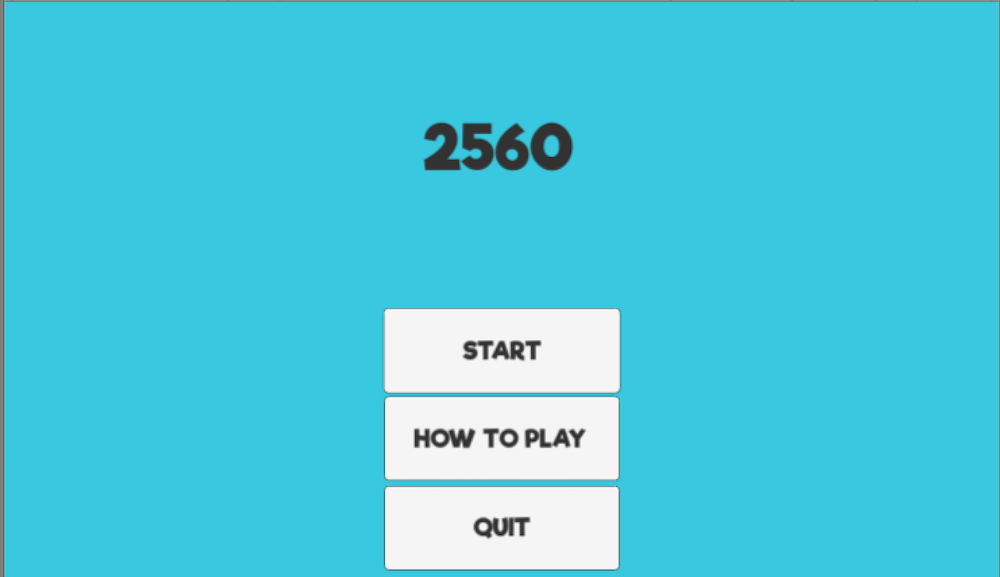
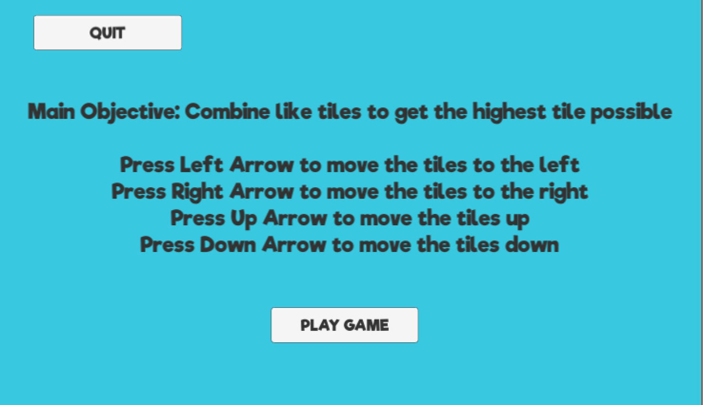
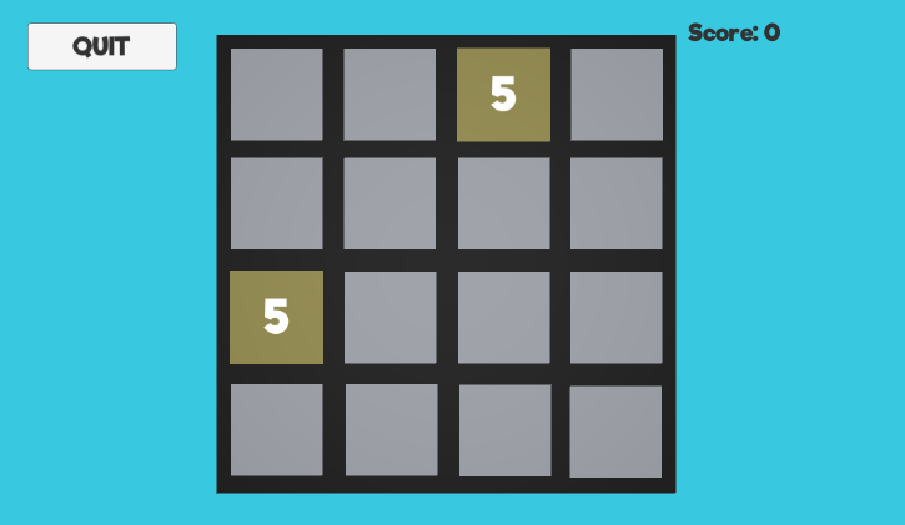
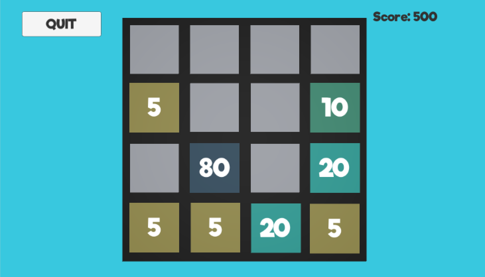
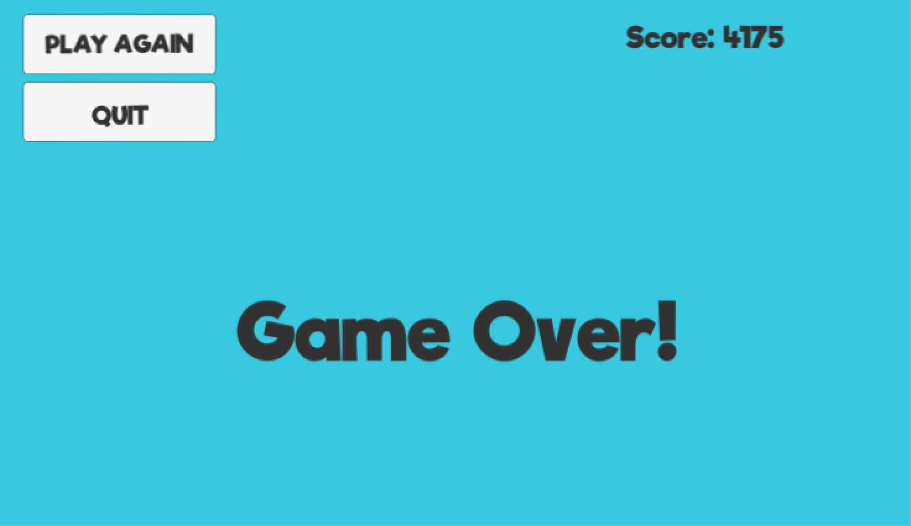

# 2560
Scripts for a clone of the game 2048 (created by: https://github.com/gabrielecirulli/2048), instead with 5s and 10s as opposed to 2s and 4s, made using the personal version of the Unity3D game engine.

## Contribution:
* I was the sole programmer for the game 2560

## Purpose:
* To develop a game similar to 2048
* To finish a game development project during the summer break
* Learn how to use Unity3D game engine

## Lessons Learned:
* Learned how to use Unity3D game engine to create a project in the summer break
* Obtained understanding of prefabs within the Unity game engine
* Gained experience in C#
* Created simple button animations
* Learned how to use different materials and change them within code
* Created a scoring system for the game
    
## Screenshots:

This is the main menu of the game, that you would see when you start the game up:

This is the screen to show how to play the game:

The next two images are of the gameplay of 2560:

The game over screen showing how many points you scored throughout the game:

